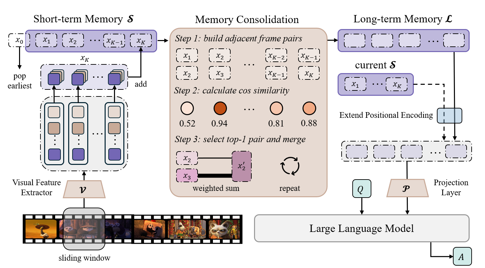

<p align="center" width="100%">
<a target="_blank"></a>
</p>

# From Dense Token to Sparse Memory for Long Video Understanding

[](https://arxiv.org/abs/2307.16449)

MovieChat can handle videos with >10K frames on a 24GB graphics card. MovieChat has a 10000× advantage over other methods in terms of the average increase in GPU memory cost per frame (21.3KB/f to ~200MB/f).
<p align="center" width="100%">
<a target="_blank"></a>
</p>


## :fire: News

* **[2023.8.1]** :page_with_curl: We release the [paper](https://arxiv.org/abs/2307.16449).
* **[2023.7.31]** We release eval [code and instraction](https://github.com/rese1f/MovieChat/tree/main/eval_code) for short video QA on **MSVD-QA**, **MSRVTT-QA** and **ActivityNet-QA**.
* **[2023.7.29]** We release [Gradio demo](https://github.com/rese1f/MovieChat/tree/main/Gradio_demo) of MovieChat.
* **[2023.7.22]** We release source code of MovieChat.
  

[](https://paperswithcode.com/sota/zeroshot-video-question-answer-on-activitynet?p=moviechat-from-dense-token-to-sparse-memory)\
[](https://paperswithcode.com/sota/zeroshot-video-question-answer-on-msrvtt-qa?p=moviechat-from-dense-token-to-sparse-memory)\
[](https://paperswithcode.com/sota/zeroshot-video-question-answer-on-msvd-qa?p=moviechat-from-dense-token-to-sparse-memory)
## Overview



## Examples

<div style="color:orange; border-bottom: 1px solid #d9d9d9;
    display: inline-block;
    color: #999;
    padding: 2px;"> Question and answer about clips from Zootopia, a cartoon, which tells the story of a determined police officer rabbit named Judy
who pairs up with a cunning fox to uncover a conspiracy about missing animals and develop an unexpected friendship.
</div>

<p align="center" width="100%">
<a target="_blank"></a>
</p>


<div style="color:orange; border-bottom: 1px solid #d9d9d9;
    display: inline-block;
    color: #999;
    padding: 2px;"> Question and answer about clips from Goblin, which tells the story of Kim Shin, an immortal ”goblin” who needs to find a human
bride to end his endless life but instead meets Ji Eun-tak, a girl fated to die who claims to be the ”goblin’s bride,” leading to a romantic tale unfolding bet.
</div>
<p align="center" width="100%">
<a target="_blank"></a>
</p>

## Install 

### Environment Preparation

First, ceate a conda environment:
```
conda env create -f environment.yml
conda activate moviechat
```

### Prerequisites

Before using the repository, make sure you have obtained the following checkpoints:

#### Pre-trained Language Decoder

- Get the original LLaMA weights in the Hugging Face format by following the instructions [here](https://huggingface.co/docs/transformers/main/model_doc/llama).
- Download Vicuna delta weights :point_right: [[7B](https://huggingface.co/lmsys/vicuna-7b-delta-v0)] (Note: we use **v0 weights** instead of v1.1 weights). 
- Use the following command to add delta weights to the original LLaMA weights to obtain the Vicuna weights:

```
python apply_delta.py \
    --base ckpt/LLaMA/7B_hf \
    --target ckpt/Vicuna/7B \
    --delta ckpt/Vicuna/vicuna-7b-delta-v0 \
```

#### Pre-trained Visual Encoder for MovieChat
- Download the MiniGPT-4 model (trained linear layer) from this [link](https://drive.google.com/file/d/1a4zLvaiDBr-36pasffmgpvH5P7CKmpze/view).

#### Download Pretrained Weights

- Download pretrained weights to run MovieChat with Vicuna-7B as language decoder locally from this [link](https://huggingface.co/DAMO-NLP-SG/Video-LLaMA-Series/resolve/main/finetune-vicuna7b-v2.pth).

## How to Run Demo Locally

Firstly, set the `llama_model`, `llama_proj_model` and `ckpt` in [eval_configs/MovieChat.yaml](./eval_configs/MovieChat.yaml).
Then run the script:
```
python inference.py \
    --cfg-path eval_configs/MovieChat.yaml \
    --gpu-id 0 \
    --num-beams 1 \
    --temperature 1.0 \
    --text-query "What is he doing?" \
    --video-path src/examples/Cooking_cake.mp4 \
    --fragment-video-path src/video_fragment/output.mp4 \
    --cur-min 1 \
    --cur-sec 1 \
    --middle-video 1 \
```
Note that, if you want to use the global mode (understanding and question-answering for the **whole** video), remember to change middle-video into 0.


## Acknowledgement
We are grateful for the following awesome projects our MovieChat arising from:
* [Video-LLaMA](https://github.com/DAMO-NLP-SG/Video-LLaMA): An Instruction-tuned Audio-Visual Language Model for Video Understanding
* [Token Merging](https://github.com/facebookresearch/ToMe): Your ViT but Faster
* [XMem](https://github.com/hkchengrex/XMem): Long-Term Video Object Segmentation with an Atkinson-Shiffrin Memory Model
* [MiniGPT-4](https://github.com/Vision-CAIR/MiniGPT-4): Enhancing Vision-language Understanding with Advanced Large Language Models
* [FastChat](https://github.com/lm-sys/FastChat): An Open Platform for Training, Serving, and Evaluating Large Language Model based Chatbots
* [BLIP-2](https://github.com/salesforce/LAVIS/tree/main/projects/blip2): Bootstrapping Language-Image Pre-training with Frozen Image Encoders and Large Language Models 
* [EVA-CLIP](https://github.com/baaivision/EVA/tree/master/EVA-CLIP): Improved Training Techniques for CLIP at Scale
* [LLaMA](https://github.com/facebookresearch/llama): Open and Efficient Foundation Language Models
* [VideoChat](https://github.com/OpenGVLab/Ask-Anything): Chat-Centric Video Understanding
* [LLaVA](https://github.com/haotian-liu/LLaVA): Large Language and Vision Assistant


## Term of Use
Our MovieChat is just a research preview intended for non-commercial use only. You must **NOT** use our MovieChat for any illegal, harmful, violent, racist, or sexual purposes. You are strictly prohibited from engaging in any activity that will potentially violate these guidelines. 

## Citation

If you find MovieChat useful for your your research and applications, please cite using this BibTeX:

```bibtex
@article{song2023moviechat,
  title={MovieChat: From Dense Token to Sparse Memory for Long Video Understanding},
  author={Song, Enxin and Chai, Wenhao and Wang, Guanhong and Zhang, Yucheng and Zhou, Haoyang and Wu, Feiyang and Guo, Xun and Ye, Tian and Lu, Yan and Hwang, Jenq-Neng and others},
  journal={arXiv preprint arXiv:2307.16449},
  year={2023}
}
```
